# OpenShift Partner Labs [WIP]

> Event-driven lab provisioning platform — request, provision, manage, and decommission lab environments through a fully decoupled, message-driven architecture.

[]()
[]()
[]()

---

## Overview

OpenShift Partner Labs enables users and lab managers to self-service lab environments through a web interface. Under the hood, every component communicates exclusively through a central message broker — no direct coupling, no shared state, no tight dependencies. Workers are stateless and horizontally scalable. A single DB Writer owns all database mutations, providing a complete audit trail and eliminating race conditions.

The system is **language-agnostic by design**. Each component is an isolated container that publishes and subscribes to messages. The implementing team selects a primary language for consistency, but individual components can diverge when there's a compelling reason.

---

## Architecture


---

## Repositories

| Repository | Description | Status |
|---|---|---|
| [`portal`](#portal) | Frontend web application — user-facing UI for lab requests and management | 🟡 Planned |
| [`queue`](#queue) | Message broker configuration, schemas, and infrastructure | 🟡 Planned |
| [`workers`](#workers) | All stateless queue workers (provisioning, deprovision, notification, day one, day two) | 🟡 Planned |
| [`scribe`](#scribe) | DB Writer service — single-instance event sink that owns all database writes | 🟡 Planned |
| [`datastore`](#datastore) | Database schema, migrations, seed data, and backup tooling | 🟡 Planned |
| [`commons`](#commons) | Shared library — message schemas, broker client, constants, types | 🟡 Planned |
| [`messenger`](#messenger) | Slack/Teams bot for lab notifications and interactive commands | 🟡 Planned |
| [`infra`](#infra) | Infrastructure as Code — Terraform/Pulumi for all cloud resources | 🟡 Planned |
| [`deploy`](#deploy) | Kubernetes manifests, Helm charts, and GitOps configuration | 🟡 Planned |
| [`docs`](#docs) | System design document, ADRs, runbooks, and onboarding guides | 🟡 Planned |

---

### `portal`

> Frontend web application

The user-facing interface where users submit lab requests and lab managers administer environments. Publishes all commands to the message broker. Reads lab state from Postgres via a **read-only** database connection.

**Key responsibilities:**
- Client-side form validation
- Publish commands to the broker (e.g., `lab-request-submitted`, `deprovision-requested`)
- Display lab status, history, and configuration from the database
- Polling or WebSocket updates for near-real-time state changes

**Does not:**
- Write to the database
- Communicate with workers directly
- Contain business logic beyond input validation

---

### `queue`

> Message broker configuration and schemas

Everything related to the central message broker — queue definitions, topic/routing configuration, dead-letter queue setup, TTL policies, and connection credentials management.

**Contents:**
- Broker configuration files (exchanges, queues, bindings, policies)
- Dead-letter queue and TTL configuration
- Authentication and permission setup
- Health check and monitoring endpoints
- Docker Compose or Helm config for local/dev broker instances

**Broker requirements:**
- Message persistence until acknowledged
- TTL with dead-letter routing for timeout detection
- Topic-based routing to dispatch messages to correct workers
- Source validation on incoming connections

> [!NOTE]
> The broker technology is not yet decided. Candidates: RabbitMQ, NATS, AWS SQS/SNS. See [`docs`](#docs) for the ADR.

---

### `workers`

> Stateless queue workers

All domain-specific workers live in this repo as separate modules/packages, each with its own entry point and Dockerfile. Workers share a common contract but are independently deployable and scalable.


**Worker contract — every worker must:**
- Be stateless (no in-memory state between messages)
- Be idempotent (processing the same message twice produces the same result)
- Publish a status message on job start (`*-started`) and completion (`*-complete` / `*-failed`)
- Be horizontally scalable (N instances competing for messages)

| Worker | Subscribes To | Publishes |
|---|---|---|
| `worker-provisioning` | `provision-lab` | `provisioning-started`, `provisioning-complete`, `provisioning-failed` |
| `worker-deprovision` | `deprovision-lab` | `deprovision-started`, `deprovision-complete`, `deprovision-failed` |
| `worker-notification` | `notify-user-*`, `notify-admin-*` | `notification-sent`, `notification-failed` |
| `worker-day-one` | `run-day-one-setup` | `day-one-started`, `day-one-complete`, `day-one-failed` |
| `worker-day-two` | `run-day-two-ops` | `day-two-started`, `day-two-complete`, `day-two-failed` |

**Suggested repo structure:**
```
workers/
├── worker-provisioning/
│   ├── Dockerfile
│   ├── src/
│   └── tests/
├── worker-deprovision/
│   ├── Dockerfile
│   ├── src/
│   └── tests/
├── worker-notification/
│   ├── Dockerfile
│   ├── src/
│   └── tests/
├── worker-day-one/
│   ├── Dockerfile
│   ├── src/
│   └── tests/
├── worker-day-two/
│   ├── Dockerfile
│   ├── src/
│   └── tests/
└── README.md
```

> [!TIP]
> Adding a new worker? Create a new directory, implement the worker contract, subscribe to the appropriate topic, and deploy. No changes to any other component required.

---

### `scribe`

> DB Writer — event sink service

The single-instance service that owns **all writes** to Postgres. Subscribes to state-changing events on the broker, validates and deduplicates them, and serializes state changes into the database. Also publishes follow-on commands after successful writes (e.g., after recording `provisioning-complete`, publishes `notify-user-lab-ready` and `run-day-one-setup`).

**Key responsibilities:**
- Subscribe to all state-changing broker events
- Deduplicate requests (idempotency key check)
- Enforce state machine transitions
- Manage retry logic (count, backoff, escalation)
- Write all state transitions with timestamps for audit trail
- Publish follow-on commands to trigger downstream workers

**Scaling path:**
The default deployment is a single instance. For higher throughput, the documented scale-out path is **partitioned writers** — run N instances each owning a partition by entity ID hash. See ADR-006 in [`docs`](#docs).


---

### `datastore`

> Database schema, migrations, and tooling

Owns the Postgres schema definition, migration scripts, seed data for development, and backup/restore tooling. This is the **only repo that defines the database structure**. The `scribe` service consumes the schema; it does not define it.

**Contents:**
- Migration scripts (versioned, idempotent)
- Schema definition (tables, indexes, constraints)
- Seed data for local development
- Backup and restore scripts
- Database role definitions (read-write for `scribe`, read-only for `portal`)

**Core tables (starting point):**
- `labs` — lab records with state machine status
- `lab_events` — audit log of all state transitions
- `notifications` — notification delivery log
- `retry_tracking` — retry counts, backoff state, dead-letter records

> [!NOTE]
> Migration tooling is not yet selected. Candidates: Flyway, Alembic, golang-migrate, dbmate.

---

### `commons`

> Shared library

Language-neutral definitions and shared utilities consumed by all other repos. If the team uses a single language, this is a native package. If polyglot, these are schema definitions (JSON Schema, Protobuf, or Avro) with per-language generated clients.

**Contents:**
- Message schema definitions (all event types, required fields, versioning)
- Broker client wrapper (publish, subscribe, acknowledge)
- Constants (event type strings, status values, queue names)
- Shared types/interfaces

**Message contract — every message must include:**
```
event_type       string     e.g., "lab-request-submitted"
event_id         UUID       deduplication and tracing
timestamp        ISO 8601   UTC
source           string     publishing component identifier
payload          object     event-specific data
correlation_id   UUID       links all events in a single workflow
version          string     schema version
```

---

### `messenger`

> Slack/Teams notification bot

An optional but recommended component that extends the `worker-notification` capabilities with interactive messaging. Can subscribe directly to broker events or be triggered by the notification worker.

**Capabilities:**
- Send lab provisioning status updates to Slack/Teams channels
- Interactive commands (e.g., `/lab status`, `/lab request`, `/lab deprovision`)
- Approval workflows for lab managers via message buttons
- Escalation alerts for failures and timeouts

> [!NOTE]
> This is an extension component. The core notification worker handles email and basic alerts. `messenger` adds rich interactive messaging.

---

### `infra`

> Infrastructure as Code

All cloud infrastructure defined as code — broker clusters, database instances, networking, IAM, container registries, and secrets management.

**Contents:**
- IaC modules (broker, database, networking, compute)
- Environment configurations (dev, staging, production)
- Secrets management setup
- Network segmentation (private subnets for broker/DB/workers; public for portal)

> [!NOTE]
> IaC tooling is not yet selected. Candidates: Terraform, Pulumi, AWS CDK.

---

### `deploy`

> Kubernetes manifests and GitOps configuration

Deployment definitions for all components — manifests, Helm charts, and GitOps controller configuration. The GitOps controller watches this repo and reconciles cluster state.

**Contents:**
- Kubernetes manifests or Helm charts for every component
- HPA (Horizontal Pod Autoscaler) configs for workers
- GitOps controller configuration (ArgoCD applications or Flux kustomizations)
- Environment overlays (dev, staging, production)
- Health check and readiness probe definitions

**Deployment flow:**


---

### `docs`

> Documentation hub

Central documentation for the platform — system design, architecture decision records, runbooks, onboarding guides, and operational procedures.

**Contents:**
- `system-design.md` — comprehensive system design document
- `adr/` — architecture decision records (ADR-001 through ADR-006+)
- `runbooks/` — operational procedures (deploy, rollback, incident response)
- `onboarding/` — getting started guides for new contributors
- `diagrams/` — Mermaid source files for all architecture diagrams
- `rfcs/` — proposals for significant changes

---

## Data Flow

The provisioning lifecycle follows this sequence:

```mermaid
sequenceDiagram
    participant U as User
    participant P as portal
    participant Q as queue (broker)
    participant S as scribe (DB Writer)
    participant DB as datastore (Postgres)
    participant W as workers

    U->>P: Submit lab request
    P->>Q: Publish lab-request-submitted
    Q-->>S: Deliver event
    S->>DB: Write lab record (pending)
    S->>Q: Publish provision-lab
    Q-->>W: Deliver to provisioning worker
    W->>Q: Publish provisioning-started
    Q-->>S: Deliver event
    S->>DB: Update status → provisioning
    W->>Q: Publish provisioning-complete
    Q-->>S: Deliver event
    S->>DB: Update status → active
    S->>Q: Publish notify-user-lab-ready
    S->>Q: Publish run-day-one-setup
    Q-->>W: Deliver to notification + day-one workers
```



---

## Lab State Machine


---

## Getting Started

### Prerequisites

- Docker and Docker Compose
- Access to this GitHub org
- [TODO] Language-specific toolchain

### Local Development

```bash
# 1. Clone the repos you need
git clone git@github.com:/portal.git
git clone git@github.com:/workers.git
git clone git@github.com:/scribe.git
git clone git@github.com:/commons.git

# 2. Start infrastructure (broker + database)
# [TODO] Docker Compose file location — likely in infra or a top-level dev-environment repo
docker compose up -d broker postgres

# 3. Run migrations
# [TODO] Migration command

# 4. Start components
# [TODO] Per-component start commands
```

> [!IMPORTANT]
> Local development setup is a work in progress. See [`docs`](#docs) for the latest onboarding guide.

---

## Design Principles

| Principle | What it means in practice |
|---|---|
| **Decoupled by default** | Every component communicates through the broker. Adding or removing a component requires zero changes to others. |
| **Stateless workers** | Workers carry no state between messages. Scale any worker type by adding instances. |
| **Single writer** | Only `scribe` writes to the database. No race conditions, no distributed transactions, full audit trail. |
| **Language agnostic** | Any language that can pub/sub on the broker works. The shared contract is the message schema, not a code dependency. |
| **GitOps everything** | Git is the source of truth for infrastructure, deployment, and configuration. All changes via PR. |
| **Observable** | Structured logs with correlation IDs, metrics on queue depth and processing time, alerts on failures and timeouts. |

---

## Contributing

1. Check [`docs`](#docs) for architecture context and ADRs before proposing changes
2. Open an issue in the relevant repo to discuss before starting work
3. Follow the branching strategy: `feature/*` → PR → `develop` → `main`
4. All PRs require review and passing CI
5. Update documentation in [`docs`](#docs) for any architectural changes

> [!TIP]
> **Adding a new worker type?** See the [workers](#workers) section. Create a new module, implement the worker contract, subscribe to a topic, deploy. No changes to other components.
>
> **Proposing an architectural change?** Write an RFC in [`docs`](#docs) and open it for discussion before implementation.

---

## Open Decisions

The following decisions are tracked in [`docs`](#docs) and must be resolved:

- [ ] Message broker technology (RabbitMQ / NATS / SQS)
- [ ] Primary implementation language
- [ ] Frontend framework
- [ ] IaC tooling (Terraform / Pulumi)
- [ ] GitOps controller (ArgoCD / Flux)
- [ ] Database migration tooling
- [ ] Secrets management approach
- [ ] Authentication and authorization model (OAuth / SAML)
- [ ] Monitoring platform (Prometheus+Grafana / Datadog)
- [ ] Message schema format (JSON Schema / Protobuf / Avro)

---

<p align="center"><sub>OpenShift Partner Labs — Event-Driven Lab Provisioning</sub></p>
